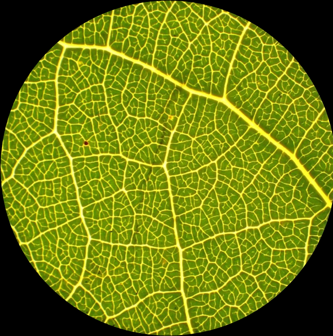

# __prospect__ 

# An R package for the simulation of leaf optical properties based on their biochemical and biophysical properties using the PROSPECT leaf model. 

[](https://www.r-project.org/Licenses/GPL-3)
[](https://gitlab.com/jbferet/prospect/pipelines/latest)

# 1 Install

After installing package `devtools`, the package `prospect` can be installed with the following command line in R session:
```
devtools::install_github("jbferet/prospect")
```

# 2 Tutorial

<!-- README.md is generated from README.Rmd. Please edit that file -->

<!-- ```{r include = FALSE} -->
<!-- knitr::opts_chunk$set( -->
<!--   collapse = TRUE, -->
<!--   comment = "#>", -->
<!--   fig.path = "man/figures/README-", -->
<!--   out.width = "100%" -->
<!-- ) -->
<!-- ``` -->

A tutorial vignette is available [here](https://jbferet.gitlab.io/prospect/articles/prospect1.html).


# 3 Acknowledgments / Fundings

This research was supported by the Agence Nationale de la Recherche ([ANR](https://anr.fr/en/open-calls-and-preannouncements/), France) through the young researchers project **BioCop** (ANR-17-CE32-0001)


# 4 Citation

If you use **prospect**, please cite the following references for PROSPECT-PRO and PROSPECT-D:

Féret, J.-B., Berger, K., de Boissieu, F. & Malenovský, Z. (2021). PROSPECT-PRO for estimating content of nitrogen-containing leaf proteins and other carbon-based constituents. Remote Sensing of Environment. 252, 112173.  https://doi.org/10.1016/j.rse.2020.112173

Féret, J.-B., Gitelson, A.A., Noble, S.D. & Jacquemoud, S. (2017). PROSPECT-D: Towards modeling leaf optical properties through a complete lifecycle. Remote Sensing of Environment. 193, 204–215. http://dx.doi.org/10.1016/j.rse.2017.03.004

The inversion of PROSPECT using only directional-hemispherical reflectance or directional-hemispherical transmittance, and prior estimation of N is explained here: 

Spafford, L., le Maire, G., MacDougall, A., de Boissieu, F. & Féret, J.-B. (2021). Spectral subdomains and prior estimation of leaf structure improves PROSPECT inversion on reflectance or transmittance alone. Remote Sensing of Environment. 252, 112176.  https://doi.org/10.1016/j.rse.2020.112176
