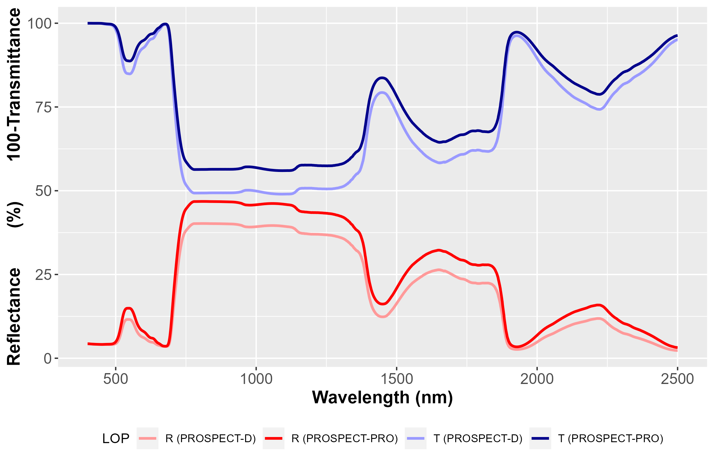

# Summary

PROSPECT simulates leaf optical properties (LOP)
based on a limited set of light absorbing chemical constituents, and a unique leaf 
structure parameter to account for light scattering.
We present `prospect`, an R package which includes the most recent versions of the model, 
complemented with multiple inversion routines to estimate leaf chemistry from LOP.

# Statement of need

LOP are linked to their biophysical properties through absorption 
and scattering mechanisms. PROSPECT takes advantage of specific absorption coefficients from chemical constituents 
such as leaf pigments, water and proteins, and uses a simplified representation of leaf structure 
through the generalised plate model [@allen1970] to simulate leaf directional-hemispherical 
reflectance and transmittance. 
The capacity to measure, map and monitor vegetation chemical traits from leaf to canopy scale 
is key to better understand ecosystems and agrosystems functions, as well as carbon, water and energy budgets. 
Models and methods taking advantage of optical meaasurements to estimate these core constituents are 
important components in this perspective.

Techniques based on spectroscopy have developed in the past decades to provide a 
rapid, accurate and non-destructive estimation of leaf chemical composition. 
Physical models aim at simulating LOP corresponding to this chemical composition, but they can 
also be used to estimate chemical composition from LOP based on inversion techniques. 

Multiple versions aiming at expanding the pool of chemical constituents accounted for by PROSPECT 
have been released since its first version [@jacquemoud1990].
Successive versions introduced carotenoids [@feret2008] and anthocyanins [@feret2017], to simulate 
LOP from juvenile to mature and senescent development stages. 
The latest version, PROSPECT-PRO, separates dry matter constituents into proteins and carbon based constituents. 
In parallel with the updated versions of the model, model inversion strategies are also developed 
to improve the estimation of leaf chemical constituents [@feret2019; @spafford2021].

To ensure access to latest advances in terms of model version and inversion strategies, 
the R package `prospect` includes the most recent versions of PROSPECT, 
and parameterizable inversion routines, allowing users to design and test their own inversion strategy.


# Overview

Two versions of the model PROSPECT are implemented in `prospect`: PROSPECT-D [@feret2017] and 
PROSPECT-PRO [@feret2021]. For each version, it is possible to also include the influence brown pigments, 
which appear during senescence, by ending the name of the version with `B`. 
Table \ref{table:1} provides an overview of the leaf chemical constituents included in the different versions which can be specified when calling the function `PROSPECT`.

| Version 	| `D` 	| `DB` 	| `PRO` | `PROB`|
|---------	|------	|:----:	|:----:	|:----:	|
| CHL     	| **X** | **X** | **X** | **X** |
| CAR   	| **X** | **X** | **X** | **X** |
| ANT   	| **X** | **X** | **X** | **X** |
| EWT   	| **X** | **X** | **X** | **X** |
| LMA   	| **X** | **X** |     	|     	|
| PROT  	|     	|      	| **X** | **X** |
| CBC   	|      	|    	| **X** | **X** |
| BROWN 	|   	| **X** |    	| **X** |

: Versions of the model PROSPECT available in the `prospect` package and 
corresponding chemical constituents (CHL: chlorophylls; CAR: carotenoids; 
ANT: anthocyanins; EWT: equivalent water thickness; LMA: leaf mass per area; 
PROT: proteins; CBC: carbon based constituents; 
BROWN: brown pigments).\label{table:1}

The inversion procedure is based on an optimization algorithm aiming at finding the minimum of multivariable 
functions with nonlinear constraints. Table \ref{table:2} provides information on the optimal spectral range used to estimate leaf 
chemical constituents from their optical properties, as identified by [@feret2019; @spafford2021].

| Constituent 	|    Optimal spectral domain     	|            Versions      |
|------------	|---------------------------------	|:---------------------:   |
| CHL       	|           700 -- 720           	| `D`, `DB`, `PRO`, `PROB` |
| CAR       	|           520 -- 560            	| `D`, `DB`, `PRO`, `PROB` |
| ANT       	|           400 -- 800           	| `D`, `DB`, `PRO`, `PROB` |
| BROWN     	|               NA               	| NA                       |
| EWT       	|          1700 -- 2400           	| `D`, `DB`, `PRO`, `PROB` |
| LMA       	|          1700 -- 2400           	| `D`, `DB`                |
| PROT      	| 2100 -- 2139 ; 2160 -- 2179     	| `PRO`, `PROB`            |
| CBC       	| 1480 -- 1499;	1560 -- 1579;	 1760 -- 1799; 2040 -- 2059;	 2120 -- 2139; 2160 -- 2239;	 2260 -- 2279; 2340 -- 2359;	 2380 -- 2399 	| `PRO`, `PROB`                      	|

: Optimal spectral domains selected to estimate vegetation chemical constituents from leaf 
optical properties (CHL: chlorophylls; CAR: carotenoids; 
ANT: anthocyanins; EWT: equivalent water thickness; LMA: leaf mass per area; 
PROT: proteins; CBC: carbon based constituents; 
BROWN: brown pigments).\label{table:2}

# Example 1: running PROSPECT in forward mode

## Individual simulation with PROSPECT-D and PROSPECT-PRO

PROSPECT is run in forward mode to simulate leaf directional-hemispherical reflectance 
and transmittance from the leaf structure parameter and a combination of chemical constituents.
The variable `SpecPROSPECT` is automatically available as a dataframe when loading `prospect`. 
`SpecPROSPECT` includes the leaf refractive index and all specific absorption coefficents defined on the spectral 
range from 400 nm to 2500 nm.

These two examples illustrate how to run PROSPECT. 
The function `PROSPECT` identifies the version to be used: PROSPECT-D is used if LMA is defined, 
while PROSPECT-PRO is used if proteins and carbon based constituents (CBC) are defined. 
If LMA, proteins and CBC are defined simultaneously, PROSPECT-PRO is used and LMA is set to 0.
Figure \ref{fig:LOP} compares simulated LOP. Here, the differences between PROSPECT-D and PROSPECT-PRO 
are mainly driven by the difference set for the `N` structure parameter.

```r
# Load prospect package
library(prospect)
# Run PROSPECT-D
LRT_D <- PROSPECT(SpecPROSPECT, CHL = 45, CAR = 10, ANT = 0.2, 
                  EWT = 0.012, LMA = 0.010, N = 1.3)
# Run PROSPECT-PRO
LRT_PRO <- PROSPECT(SpecPROSPECT, CHL = 45, CAR = 10, ANT = 0.2, 
                    EWT = 0.012, PROT = 0.001,  CBC = 0.009, N = 1.7)
```

{ width=85% }

## Simulation of a look up table with PROSPECT-D

Look-Up-Tables (LUTs) are widely used in order to infer leaf characteristics from PROSPECT. 
The function `PROSPECT_LUT` computates a LUT based on a list of input parameters.
Undefined parameters are set to their default value. Vectors of values are expected to be the same length.
The output of `PROSPECT_LUT` is a list containing a dataframe including the input parameters, 
a reflectance matrix and a transmittance matrix.

```r
CHL <- 100*runif(1000); CAR <- 25*runif(1000)
ANT <- 2*runif(1000); EWT <- 0.04*runif(1000)
LMA <- 0.02*runif(1000); N   <- 1+2*runif(1000)
Input_PROSPECT <- data.frame('CHL' = CHL, 'CAR' = CAR, 'ANT' = ANT, 
                             'EWT' = EWT, 'LMA' = LMA, 'N' = N)
LUT <- PROSPECT_LUT(SpecPROSPECT,Input_PROSPECT)
```

# Example 2: PROSPECT inversion using iterative optimization

Several approaches can be used to perform PROSPECT inversion. As PROSPECT is a relatively simple and 
computationally efficient model, inversion based on iterative optimization is one of the most popular 
method to invert PROSPECT and estimate leaf chemistry and structure from their optical properties. 
Here, the iterative optimization is based on the minimization of a multivariable function with nonlinear constraints. 
This procedure is based on the function `fmincon` included in the package `pracma`.

Various inversion strategies have been proposed in the literature. 
These inversion strategies differ either by the cost function, or by the 
selection of specific spectral domains aiming at optimizing the retrieval of one or several 
leaf biophysical properties, or by the introduction of prior information. 

The package `prospect` offers possibilities to adjust these parameters for inversion. 
Here, we will illustrate different types of inversion with an experimental database named __ANGERS__.
This database was used to calibrate the model PROSPECT, and is among the most popular public 
datasets in the domain of leaf spectroscopy.

## Downloading the ANGERS dataset and adjusting leaf optics

A version of the ANGERS dataset is hosted on gitlab, and can be directly downloaded from R.

```r
# use data.table library
library(data.table)
# download ANGERS leaf optics database from gitlab repository
gitlab_Rep <- 'https://gitlab.com/jbferet/myshareddata/raw/master/LOP'
# download leaf biochemical constituents and leaf optical properties
fileName <- list('DataBioch.txt','ReflectanceData.txt','TransmittanceData.txt')
DataBioch <- data.table::fread(file.path(gitlab_Rep,'ANGERS',fileName[[1]]))
Refl<- data.table::fread(file.path(gitlab_Rep,'ANGERS',fileName[[2]]))
Tran <- data.table::fread(file.path(gitlab_Rep,'ANGERS',fileName[[3]]))
# Get the wavelengths corresponding to reflectance and transmittance measurements  
lambda <- unlist(Refl$V1, use.names=FALSE)
Refl$V1 <- Tran$V1 <- NULL
```

## PROSPECT inversion using the full spectral range available

The spectral domains covered by `SpecPROSPECT` and the leaf optical properties are expected to match 
when performing inversion on the full spectral domain covered by the data.

```r
# Adjust spectral domain for SpecPROSPECT to fit leaf optical properties 
SubData <- FitSpectralData(SpecPROSPECT = SpecPROSPECT,
                           Refl = Refl, Tran = Tran,
                           lambda = lambda, UserDomain = lambda)
```

The main inversion procedure is called with the function `Invert_PROSPECT`, which minimizes a cost function. 
The default cost function, `CostVal_RMSE`, corresponds to the root mean square of the mean quadratic difference between 
measured and simulated leaf optical properties (either reflectance and transmittance, or one of them only).
Users can define their own cost function. They can also select the biophyscal properties to estimate: 
The full set (`Parms2Estimate` set to `ALL`) or a reduced set of variables to estimate can 
be defined in `Parms2Estimate`. The value set for parameters which are not estimated is then defined 
with the `InitValues` input variable. 

```r
# Estimate all parameters using PROSPECT inversion applied to full spectral data
res_all_WL <- Invert_PROSPECT(SpecPROSPECT = SubData$SpecPROSPECT, 
                              Refl = SubData$Refl,  Tran = SubData$Tran)
```

## PROSPECT inversion using the optimal spectral domains specific to each constituent

The function `Invert_PROSPECT_OPT` performs PROSPECT inversion using optimal spctral domains
defined in [@feret2019; @spafford2021]. The optimal spectral domains are specific to each constituent, 
and the function automatically adjusts the spectral domain of the leaf optical properties provided 
by user. 

```r
# Estimate a set of parameters using PROSPECT inversion with optimal spectral domains
Parms2Estimate  <- c('CHL', 'CAR', 'EWT', 'LMA')
res_opt_WL <- Invert_PROSPECT_OPT(SpecPROSPECT = SpecPROSPECT, lambda = lambda, 
                                  Refl = Refl, Tran = Tran,
                                  Parms2Estimate = Parms2Estimate)
```

## Comparing performances of the two types of inversion with experimental data

Figure \ref{fig:scatter} displays the outputs of the inversion, compared for each configuration of inversion
in a single scatterplot for each leaf chemical constituent.  

{ width=90% }

# Conclusion

We have described `prospect`, an R package dedicated to the PROSPECT leaf model. 
`prospect` can run different versions of the model in direct mode to simulate 
directional-hemispherical reflectance and transmittance for individual leaves or LUTs.
`prospect` also includes inversion routines in order to estimate leaf structure and chemical 
constituent content either from directional-hemispherical reflectance and transmittance, 
or from reflectance or transmittance only. 
`prospect` aims at providing latest advances in terms of model version and inversion procedures
to the leaf spectroscopy community. 


# Availability

prospect is an open-source software package made available under the GPL-3.0 license. It can be installed through GitHub repository: remotes::install_github("jbferet/prospect"). Tutorials are available at [https://jbferet.gitlab.io/prospect/](https://jbferet.gitlab.io/prospect/).

# Acknowledgements

The authors acknowledge financial support from Agence Nationale de la Recherche (BioCop project — ANR-17-CE32-0001)
We are grateful to Stephane Jacquemoud and Frederic Baret for the development of the initial version of 
the PROSPECT model. We also warmly thank Luc Bidel, Christophe François and Gabriel Pavan who collected the ANGERS dataset.

# References
