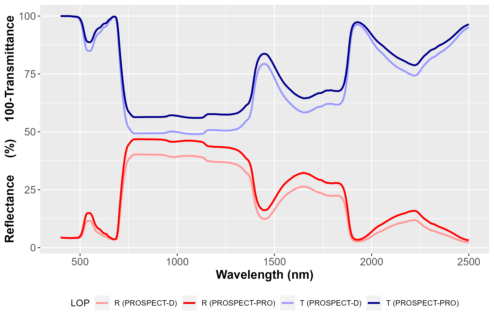

# Summary

PROSPECT simulates optical properties for a leaf, based on its content
in absorbing constituents, and a structure parameter accounting for light scattering.
We present `prospect`, an R package aiming at providing the most recent versions 
of the model, along with inversion routines to assess leaf chemistry from 
optical properties.

# Statement of need

The capacity to measure, map and monitor vegetation traits corresponding to 
biophysical and chemical properties is crucial to better understand ecosystem 
and agrosystem functions, as well as carbon, water and energy budgets. 
At leaf scale, these vegetation traits are linked to their 
optical properties through absorption and scattering mechanisms. 
Spectroscopic techniques provide rapid, accurate and non-destructive assessment 
of leaf chemical composition. 
Physical models aim at simulating optical properties of leaves from their 
chemical composition. 
Inversion techniques take advantage of these models to assess leaf chemical 
composition from optical properties. 
The model PROSPECT (leaf optical PROperties SPECtra) is currently the most popular 
physical model for the simulation of leaf optical properties. 
PROSPECT simulates leaf directional-hemispherical reflectance and transmittance 
from a combination of chemical constituents and their corresponding specific 
absorption coefficients. 
It uses a simplified representation of leaf structure through the generalised 
plate model [@allen1970] to account for scattering. 
PROSPECT can be coupled with canopy reflectance models to analyze Earth 
observation data. 
Hence, it is a key component for remote sensing applications dedicated to 
vegetation monitoring. 

Multiple versions have been released since its first version [@jacquemoud1990].
@feret2008 introduced carotenoids and @feret2017 introduced anthocyanins, 
to simulate leaf optical properties from juvenile to mature and senescent 
development stages. 
@feret2021 introduced PROSPECT-PRO, the latest version separating dry matter 
constituents into proteins and carbon based constituents. 
In parallel with updated versions of the model, model inversion strategies 
have been introduced to improve the assessment of leaf chemical constituents 
[@feret2019; @spafford2021].

PROSPECT implementations since @feret2008 can be found at 
[this webpage](http://teledetection.ipgp.jussieu.fr/prosail/).
This includes distributions in matlab, R and fortran programming languages. 
PROSPECT is coupled with vegetation models, including COSINE dedicated to 
close-range imaging spectroscopy [@jay_physically-based_2016] and SAIL 
for canopy reflectance modeling [verhoef_coupled_2007, @verhoef_unified_2007, @jacquemoud_prospect+_2009]. 
A version of `prospect` coupled with SAIL is available in the R package 
[`prosail`](https://jbferet.gitlab.io/prosail/index.html).
Note that PROSPECT and PROSAIL are also available in packages written in 
[python](https://github.com/earth-chris/xleaf), 
[Julia](https://github.com/RemoteSensingTools/CanopyOptics.jl) and [R](https://github.com/ashiklom/rrtm).

# Overview

## PROSPECT simulation in forward mode

In forward mode, PROSPECT simulates leaf directional-hemispherical reflectance 
and transmittance from a set of chemical constituents and a leaf structure 
parameter identified as `N`. 
`N` represents the number of homogeneous layers introduced in the 
generalized plate model. 

Two versions of PROSPECT are implemented in `prospect`: PROSPECT-D 
[@feret2017] and PROSPECT-PRO [@feret2021]. 
PROSPECT-4 and 5 are deprecated. 
Table \ref{table:1} lists the input leaf chemical constituents and structure parameter
for versions D and PRO available with the function `PROSPECT`.

| Version 	|  `D` 	| `PRO` |
|---------	|:----:	|:----:	|
| CHL     	| **X** | **X** |
| CAR   	| **X** | **X** |
| ANT   	| **X** | **X** |
| BROWN 	| **X** | **X** |
| EWT   	| **X** | **X** |
| LMA   	| **X** |     	|
| PROT  	|      	| **X** |
| CBC   	|    	| **X** |
| N   	    | **X** | **X** |

: Input variables for the two versions of PROSPECT implemented in the `prospect` 
package (CHL: chlorophylls; CAR: carotenoids; ANT: anthocyanins; BROWN: brown pigments; 
EWT: equivalent water thickness; LMA: leaf mass per area; PROT: proteins; 
CBC: carbon based constituents; N: leaf structure parameter).\label{table:1}

PROSPECT is a relatively simple and computationally efficient model. 
Hence iterative optimization can be considered to invert PROSPECT 
and assess leaf chemistry and structure from their optical properties. 
Iterative optimization aims at minimizing a merit function comparing 
measured and simulated leaf optical properties. 
This procedure is based on the function `fmincon` included in the package `pracma`.
It usually takes less than 1 second to perform PROSPECT inversion.

Various inversion strategies using iterative optimization are described in the 
literature [@colombo_estimation_2008, @li_retrieval_2011, @feret2019]. 
These inversion strategies differ either by the merit function, or by the 
selection of specific spectral domains used to retrieve one or several leaf 
biophysical properties, or by the introduction of prior information. 
The default merit function, `Merit_PROSPECT_RMSE`, corresponds to the root mean square 
of the mean quadratic difference between measured and simulated leaf optical 
properties (reflectance and/or transmittance).
Alternative merit functions using the same input and output variables as 
`Merit_PROSPECT_RMSE` can be defined.
The online documentation provides an example of alternative merit function.

Table \ref{table:2} details the optimal spectral domains to assess leaf chemical 
constituents from their optical properties [@feret2019; @spafford2021].

| Constituent|    Optimal spectral domain     	|   Versions   |
|----------- |---------------------------------	|:-----------: |
| CHL        |           700 -- 720           	| `D`, `PRO`   |
| CAR        |           520 -- 560            	| `D`, `PRO`   |
| ANT        |           400 -- 800           	| `D`, `PRO`   |
| BROWN      |               NA               	| NA           |
| EWT        |          1700 -- 2400           	| `D`, `PRO`   |
| LMA        |          1700 -- 2400           	| `D`          |
| PROT       | 2100 -- 2139; 2160 -- 2179     	| `PRO`        |
| CBC        | 1480 -- 1499;	1560 -- 1579;	1760 -- 1799;	2040 -- 2059;	2120 -- 2139;	2160 -- 2239;	2260 -- 2279;	2340 -- 2359;	2380 -- 2399 | `PRO`        |

: Optimal spectral domains to assess vegetation chemical constituents 
from leaf optical properties.\label{table:2}

# Example 1: running PROSPECT in forward mode

Input parameters listed in Table \ref{table:1} are required to simulate leaf 
optical properties with PROSPECT. 
Optical constants corresponding to specific absorption coefficients and leaf 
refractive index are identical for all leaves, and are defined over the 
spectral domain ranging from 400 nm to 2500 nm.
They are accessible through the variable `SpecPROSPECT_FullRange`, a data frame 
automatically loaded with the package. 
Multiple functions in the package `prospect` expect a variable `SpecPROSPECT` as input. 
`SpecPROSPECT_FullRange` is used as default value for this input variable. 
Simulated spectral characteristics, including spectral domain, sampling 
and sensor-specific spectral response can be derived from `SpecPROSPECT_FullRange`. 

The function `PROSPECT` identifies the version to be used: PROSPECT-D is used 
if LMA is defined, while PROSPECT-PRO is used if proteins (PROT) and carbon 
based constituents (CBC) are defined. 
If LMA, PROT and CBC are defined simultaneously, PROSPECT-PRO is used and LMA 
is set to 0.
Figure \ref{fig:LOP} compares simulated leaf optical properties. 
Here, the differences between PROSPECT-D and PROSPECT-PRO are mainly driven by the 
different value set for the `N` structure parameter.

```r
# Load prospect package
library(prospect)
# Run PROSPECT-D
LRT_D <- PROSPECT(CHL = 45, CAR = 10, ANT = 0.2, 
                  EWT = 0.012, LMA = 0.010, N = 1.3)
# Run PROSPECT-PRO
LRT_PRO <- PROSPECT(CHL = 45, CAR = 10, ANT = 0.2, 
                    EWT = 0.012, PROT = 0.001, CBC = 0.009, N = 1.7)
```

{ width=85% }

The spectral domain covered with PROSPECT simulations can be adjusted with the function 
`FitSpectralData`, which adjust information from `SpecPROSPECT_FullRange` to a user-defined 
spectral domain. 

```r
# define spectral bands for Visible / Near InfraRed (VNIR) simulation
wvlRange_VNIR <- seq(400,1000)
# adjust spectral properties used in PROSPECT to VNIR domain
VNIR <- FitSpectralData(lambda = wvlRange_VNIR)
# Run PROSPECT-D in VNIR domain
LRT_VNIR <- PROSPECT(SpecPROSPECT = VNIR$SpecPROSPECT,
                     N = 1.4, CHL = 30, CAR = 6, EWT = 0.02, LMA = 0.01)
```

# Example 2: PROSPECT inversion using iterative optimization

Inversion is illustated with the experimental database __ANGERS__, a publicly 
available dataset used to calibrate PROSPECT.
ANGERS can be downloaded from a gitlab repository with the function `download_LeafDB`.

```r
LeafDB <- download_LeafDB(dbName = 'ANGERS')
```

## PROSPECT inversion using the full spectral information

The spectral domains covered by `SpecPROSPECT` and the leaf optical properties 
are expected to match when performing inversion over the full spectral domain 
covered by the leaf optical properties.
The function `FitSpectralData` harmonizes the spectral domain for `SpecPROSPECT` 
and the leaf optical properties. 
A vector listing the wavelengths of interest can also be provided with `UserDomain`. 
The following R code adjusts `SpecPROSPECT` to the spectral domain of the 
leaf optical properties.

```r
# Adjust spectral domain for SpecPROSPECT to fit leaf optical properties
SubData <- FitSpectralData(SpecPROSPECT = SpecPROSPECT_FullRange,
                           Refl = LeafDB$Refl, 
                           Tran = LeafDB$Tran,
                           lambda = LeafDB$lambda, 
                           UserDomain = LeafDB$lambda)
```

The main inversion procedure is called with the function `Invert_PROSPECT`, 
which minimizes a merit function defined by `Merit_PROSPECT_RMSE` as default option.
Part or all parameters from Table \ref{table:1} can be assessed. 
Parameters assessed from PROSPECT inversion are defined with an input list, `Parms2Estimate`. 
The default parameterization of PROSPECT inversion leads to the assessment of all 
parameters listed in Table \ref{table:1} except BROWN.
BROWN can be assessed during inversion (if working with senescent leaves) by 
setting `Est_Brown_Pigments = TRUE` as input for `Invert_PROSPECT`.
The value of unassessed parameters is set in `InitValues`. 

```r
# Assess all parameters using PROSPECT inversion applied to full spectral data
res_all_WL <- Invert_PROSPECT(SpecPROSPECT = SubData$SpecPROSPECT, 
                              Refl = SubData$Refl,  
                              Tran = SubData$Tran)
```

## PROSPECT inversion using optimal spectral domains for each constituent

The function `Invert_PROSPECT_OPT` performs PROSPECT inversion using optimal 
spectral domains, specific to each constituent [@feret2019; @spafford2021]. 
The function automatically adjusts the spectral domain of the leaf optical 
properties provided as input. 

```r
# Assess a set of parameters using PROSPECT inversion with optimal spectral domains
Parms2Estimate <- c('CHL', 'CAR', 'EWT', 'LMA')
res_opt_WL <- Invert_PROSPECT_OPT(lambda = LeafDB$lambda, 
                                  Refl = LeafDB$Refl, 
                                  Tran = LeafDB$Tran
                                  Parms2Estimate = Parms2Estimate)
```

## Performances of the two types of inversion: Comparison with ANGERS data

Figure \ref{fig:scatter} compares lab measurements from CHL, CAR, EWT and LMA 
with values assessed from `Invert_PROSPECT` and `Invert_PROSPECT_OPT` using ANGERS. 

{ width=90% }

# Conclusion

We introduce `prospect`, an R package dedicated to the PROSPECT leaf model. 
`prospect` runs various versions of the model in direct mode to simulate 
directional-hemispherical reflectance and transmittance.
It also includes inversion routines to assess leaf structure and chemical 
constituent content from reflectance and/or transmittance. 
`prospect` provides latest advances in terms of model version and inversion 
procedures to the leaf spectroscopy community. 
`prospect` is coupled with the canopy model SAIL through the R package 
[`prosail`](https://jbferet.gitlab.io/prosail/index.html).
`prosail` is dedicated to applications focusing on Earth observation imagery analysis 
and allows simulation of canopy reflectance for multispectral and hyperspectral sensors.
Hybrid inversions based on physical modeling and machine learning are also implemented 
in `prosail` to assess vegetation traits at canopy scale from imagery data.

# Availability

prospect is an open-source software package made available under the MIT license. 
Tutorials are available at [https://jbferet.gitlab.io/prospect/](https://jbferet.gitlab.io/prospect/).

# Acknowledgements

The authors acknowledge financial support from Agence Nationale de la Recherche 
(BioCop project — ANR-17-CE32-0001).
We are grateful to Stéphane Jacquemoud and Frédéric Baret for the development of 
the initial version of the PROSPECT model. 
We warmly thank Luc Bidel, Christophe François and Gabriel Pavan who 
collected the ANGERS data set.
We warmly thank Christopher Anderson, Alexey Shiklomanov and Neha K. Nawandar 
for their review and the constructive comments and suggestions they provided, which 
greatly helped in improving both performances and functionalities of this package.

# References
