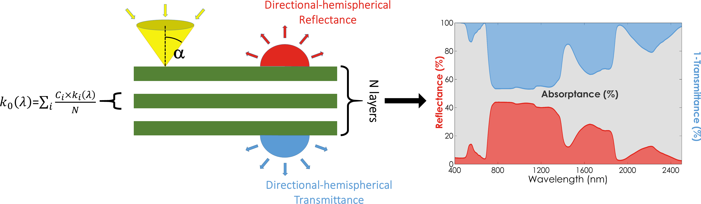
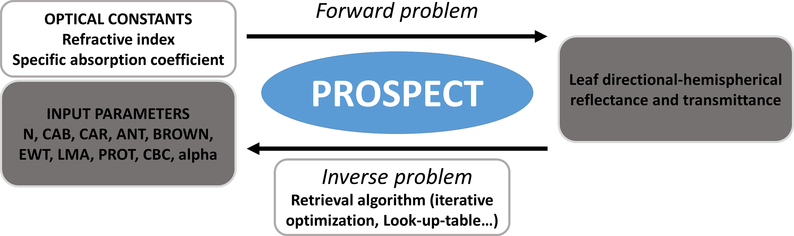

```{r setup, include = FALSE}
knitr::opts_chunk$set(
  collapse = TRUE,
  comment = "#>",
  eval=FALSE
)
```

# Brief introduction & useful links to go further

This tutorial summarizes the different functionalities of the R package `prospect` based on the eponym leaf physical model. 

This tutorial does not aim at detailling the principles of PROSPECT or comparing it to other models, as: 

* The comprehensive description of the model and the physical principes it relies on can be found in the original paper from [Jacquemoud & Baret (1990)](https://www.sciencedirect.com/science/article/abs/pii/003442579090100Z "Jacquemoud & Baret, RSE 1990")
* [this website](http://photobiology.info/Jacq_Ustin.html) and [this one](http://teledetection.ipgp.jussieu.fr/opticleaf/models.htm) provide a lot of information on this topic
* [this website](http://opticleaf.ipgp.fr/) gathers references and important links for anyone interested in leaf optical properties and physical modeling

PROSPECT aims at simulating leaf optical properties in the optical domain from 400 nm to 2500 nm based on their biophysical properties, including a limited number of biochemical constituents and a unique structure parameter, `N`. PROSPECT is based on a simple representation derived from the __extended plate model__ ([Allen et al., 1970](https://www.osapublishing.org/josa/abstract.cfm?uri=josa-60-4-542)).

Leaf optical properties correspond to __conical-hemispherical reflectance and transmittance__, and are typically measured with an integrating sphere. These optical properties are often described as __directional-hemispherical reflectance and transmittance__, although such directional quantities are conceptual quantities (see [Schaepman-Strub et al. (2006)](https://www.sciencedirect.com/science/article/abs/pii/S0034425706001167?via%3Dihub "Schaepman-Strub, RSE 2006") for a comprehensive definition of optical measurements).

Leaf reflectance measured with a leaf clip / contact probe (such as the device provided with the ASD FieldSpec spectroradiometer) does not correspond to  __conical-hemispherical reflectance__. Therefore comparing such reflectance with PROSPECT simulations (in forward and inverse mode) may lead to biased or uncertain results. See [Li et al. (2018)](https://www.sciencedirect.com/science/article/abs/pii/S0034425717305898?via%3Dihub "Li, RSE 2018") for alternative approaches taking advantage ofphysical modeling for the estimation of leaf chemistry from such reflectance measurements. 


<p>&nbsp;</p>
<center>
  
</center> 
<p>&nbsp;</p>
<center>
  Fig. 1. Representation of a leaf according to PROSPECT and corresponding leaf optical properties obtained as output
</center> 
<p>&nbsp;</p>

Note that the `alpha` parameter is also available as input, and corresponds to the maximum incidence angle relative to the normal defining the solid angle of incident light at the surface of leaf (aims at including surface roughness, default value = 40 degrees).

Many simplications can be identified, and alternative versions of the model have been developed through the years in order to increase the realism of the model. Among the many simplifications:

* The refractive index identifcal for all leaves. It should theoretically change with leaf properties

* The leaf anatomy is not differentiated between an adaxial and an abaxial face

* the leaf surface, which is defined my many properties in real life (presence of waxes, hairs, ...) is identical among leaves in PROSPECT

* ...

The current version of the model implemented in `prospect` is __PROSPECT-PRO__, which includes the following biochemical constituents (defined as _C<sub>i</sub>_ in Fig. 1):

* Chlorophyll a + b `CHL`
* Carotenoids `CAR`
* Anthocyanins `ANT`
* Prown pigments `BROWN`
* Equivalent water thickness `EWT`
* proteins `PROT`
* carbon-based consituents `CBC` (constituents of dry matter other than proteins)

If you want to use __PROSPECT-D__ instead of __PROSPECT-PRO__, please define a value for `LMA` (Leaf mass per area) and set `PROT` and `CBC` to 0, or leave no value (default value = 0) 


The specific absoprtion coefficients corresponding to these constituents are recorded in the variable `SpecPROSPECT` available when loading the package `prospect`.

# `prospect`: forward and inverse mode

In the forward mode, PROSPECT simulates leaf optical propertes based on a set of input parameters corresponding to the biochemical constituents and the N structure parameter.

The performances of PROSPECT for the simulation of the leaf optical properties are based on the proper calibration of the optical constants, more particularly the specific absorption coefficients corresponding to each biochemical constituent. 

In the inverse mode, an algorithm is used to derive the input parameters from the leaf optical properties.

See the following pages of the tutorial for an illustration of how to use `prospect` in forward and inverse mode.

<p>&nbsp;</p>
<center>
  
</center> 
<p>&nbsp;</p>
<center>
  Fig. 2. Forward and inverse modes of PROSPECT
</center> 
<p>&nbsp;</p>


# `prospect`: Miscellaneous

The package currently only includes a version of the model covering teh domain from 400 nm to 2500 nm. However, several valuable alternative versions exist, but are not available in the current version of the package:

- [PROSPECT-VISIR](https://www.sciencedirect.com/science/article/abs/pii/S0034425710002841?via%3Dihub), modeling directional–hemispherical reflectance and transmittance of fresh and dry leaves from 0.4 μm to 5.7 μm.
- [FLUSPECT](https://www.sciencedirect.com/science/article/abs/pii/S0034425718301573?via%3Dihub), radiative transfer model for leaf chlorophyll fluorescence.

These models may be added in a future version of the package.
