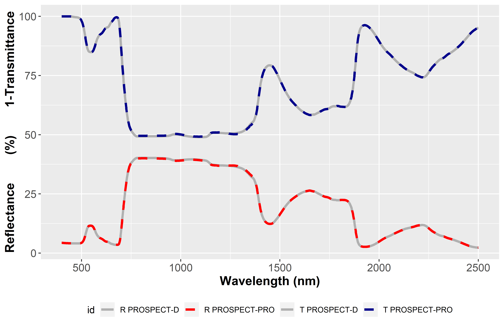
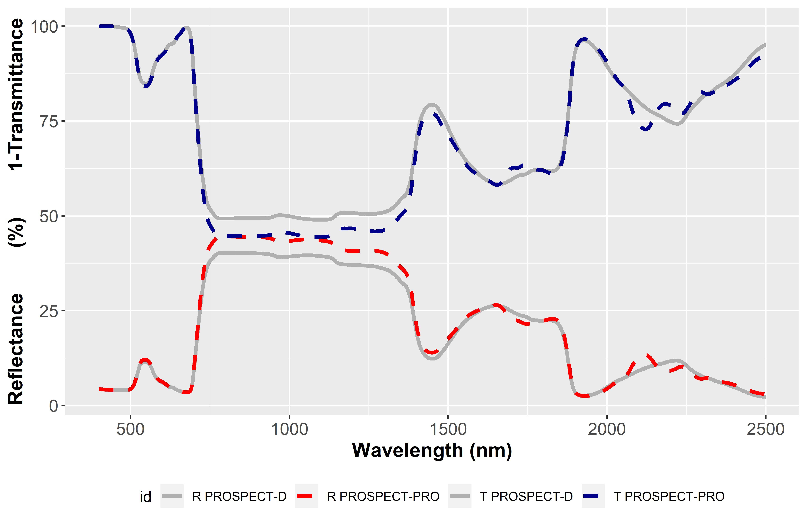

```{r setup, include = FALSE}
knitr::opts_chunk$set(
  collapse = TRUE,
  comment = "#>",
  eval=TRUE,
  results='asis',
  cache = TRUE
)

#Figure and Table Caption Numbering, for HTML do it manually
capTabNo = 1; capFigNo = 1;

#Function to add the Table Number
capTab = function(x){
  if(knitr:::is_html_output()){
    x = paste0("Table ",capTabNo,". ",x)
    capTabNo <<- capTabNo + 1
  }; x
}

#Function to add the Figure Number
capFig = function(x){
  if(knitr:::is_html_output()){
    x = paste0("Figure ",capFigNo,". ",x)
    capFigNo <<- capFigNo + 1
  }; x
}

```

<style>
  .col2 {
    columns: 2 180px;         /* number of columns and width in pixels*/
    -webkit-columns: 2 180px; /* chrome, safari */
    -moz-columns: 2 180px;    /* firefox */
  }
</style>


# Running `prospect` in forward mode

### Input variables
The function `PROSPECT` runs PROSPECT for individual samples and expects the following input variables.

* `SpecPROSPECT`: dataframe including the refractive index and specific absorption ceofficients, defined for a given spectral range (max range: 400 nm - 2500 nm). simulation and inversion on different spectral domains can be peformed by adapting the information in `SpecPROSPECT`
* The biochemical and biophysical input variables of PROSPECT are :

<div class="col2">

  *  `N` (default = 1.5)
  *  `CHL` (default = 40.0  $\mu g.cm^2$)
  *  `CAR` (default = 8.0  $\mu g.cm^2$)
  *  `ANT` (default = 0.0  $\mu g.cm^2$)
  *  `BROWN` (default = 0.0 arbitrary units)
  *  `EWT` (default = 0.01  $g.cm^2$)
  *  `LMA` (default = 0.008  $g.cm^2$)
  *  `PROT` (default = 0.0  $g.cm^2$)
  *  `CBC` (default = 0.0  $g.cm^2$)
  *  `alpha` (default = 40.0 degrees)

</div>


### Output variables
`PROSPECT` returns a list containing directional-hemispherical reflectance and transmittance (`reflectance` and `transmittance`) corresponding to the input variables, and the corresponding wavelengths in the list element `wvl`.

### Run PROSPECT using default parameters over the full range from 400 nm to 2500 nm
```{r prospect direct mode default}
library(prospect)
LRT_default <- PROSPECT(SpecPROSPECT)
```

### Run PROSPECT using user defined set of parameters over the full range from 400 nm to 2500 nm
Default value wil be set for undeclared parameters
```{r prospect direct mode VSWIR, eval=F}
LRT_VSWIR <- PROSPECT(SpecPROSPECT,N = 1.4,CHL = 30,CAR = 6,EWT = 0.02,LMA = 0.01)
```

### Run PROSPECT using user defined spectral domain
Following the same definition of the input parameters, user only has to adjust the spectral range from `SpecPROSPECT`.
`SpecPROSPECT$lambda` contains the spectral bands for the different optical constants. 

```{r prospect direct mode VNIR, eval=F}
# define the spectral range for simulations in the VNIR from 400 to 1000 nm
# identify closest spectral bands to the boundaries 
# (please adjust if you need strict inclusion / excusion of bands)
VNIR_index = dplyr::between(SpecPROSPECT$lambda, 400, 1000)
SpecPROSPECT_VNIR <- SpecPROSPECT[VNIR_index,]
LRT_VNIR <- PROSPECT(SpecPROSPECT_VNIR, N = 1.4, CHL = 30, CAR = 6, EWT = 0.02, LMA = 0.01)
```

# Comparison between PROSPECT-PRO and PROSPECT-D

PROSPECT-PRO is the latest official version of PROSPECT. However, you may not be interested in all these input biochemical constituents. 

Still, __we recommend using PROSPECT-PRO and selecting the constituents of interest, performances should correspond to your expectations__.

#### PROSPECT-D
The only difference between PROSPECT-PRO and PROSPECT-D is that LMA is divided into proteins and CBC. Therefore, the default values in `prospect` correspond to calling PROSPECT-D, as `PROT` and `CBC` are set to 0. 
Keep in mind that either `LMA` or `PROT` and `CBC` should be set to 0. A message will be displayed if it is not the case:

```{r message mix PROSPECT-D and PROSPECT-PRO, eval=F}
'PROT and/or CBC are not set to 0
LMA is not set to 0 neither, which is physically incorrect
(LMA = PROT + CBC)
We assume that PROSPECT-PRO was called and set LMA to 0
Please correct input parameters LMA, PROT and/or CBC if needed'
```

Here is an example to run PROSPECT-D:
```{r run PROSPECT-D}
LRT_D <- PROSPECT(SpecPROSPECT,
  CHL = 45, CAR = 10, ANT = .2,
  EWT = .012, LMA = .01, N = 1.3
)
```

and another one with PROSPECT-PRO, which should lead to very similar leaf optics: 
```{r run PROSPECT-PRO}
LRT_PRO <- PROSPECT(SpecPROSPECT,
  CHL = 45, CAR = 10, ANT = .2,
  EWT = .012, LMA = 0,
  PROT = .001, CBC = .009, N = 1.3
)
```
The resulting leaf optical properties are, indeed, very similar:
```{r fig-PRO-D, echo = FALSE, fig.cap = capFig('Comparison between PROSPECT-D and PROSPECT-PRO, stoichiometry respected'), fig.asp=0.4, fig.width = 7, fig.align='center'}

library(ggplot2)
library(magrittr)

# LR1mT_PRO$T = 1 - LR1mT_PRO$T
LR1mT_D = as.data.frame(LRT_D) %>% 
  dplyr::mutate(Transmittance = 1-Transmittance) %>%
  plyr::rename(replace = c('wvl' = 'Wavelength', 'Reflectance' = 'R','Transmittance'  = 'T'))

LR1mT_PRO = as.data.frame(LRT_PRO) %>%
  dplyr::mutate(Transmittance = 1-Transmittance) %>%
  plyr::rename(replace = c('wvl' = 'Wavelength', 'Reflectance' = 'R','Transmittance'  = 'T'))

data = merge(LR1mT_D, LR1mT_PRO, by = 'Wavelength', suffixes = c(' PROSPECT-D', ' PROSPECT-PRO')) %>%
  reshape2::melt(id.vars='Wavelength')
ggplot(data, aes(Wavelength, value*100, color = variable, linetype = variable))+
  geom_line()+
  scale_color_manual('', values = c('grey30', 'grey30', 'red', 'blue'))+
  scale_linetype_manual('', values = c('solid', 'solid', 'dashed', 'dashed')) +
  labs(x = 'Wavelength (nm)', y = 'Reflectance   (%)   1-Transmitance', color = '')
```


<!-- <p>&nbsp;</p> -->
<!-- <center> -->
<!--    -->
<!-- </center>  -->
<!-- <center> -->
<!--   Fig. 1. Comparison between PROSPECT-D and PROSPECT-PRO, stoichiometry respected -->
<!-- </center>  -->
<!-- <p>&nbsp;</p> -->


while using proteins without CBC to simulate LMA leads to different results: 
```{r run PROSPECT-PRO2}
LRT_PRO2 <- PROSPECT(SpecPROSPECT,
  CHL = 45, CAR = 10, ANT = .2,
  EWT = .012, LMA = 0,
  PROT = .01, CBC = 0, N = 1.3
)
```

```{r fig-PRO2-D, echo = FALSE, fig.cap = capFig('Comparison between PROSPECT-D and PROSPECT-PRO, Proteins only, no CBC'), fig.asp=0.4, fig.width = 7, fig.align='center'}
  
# LR1mT_PRO$T = 1 - LR1mT_PRO$T
LR1mT_PRO2 = as.data.frame(LRT_PRO2) %>%
  dplyr::mutate(Transmittance = 1-Transmittance) %>%
  plyr::rename(replace = c('wvl' = 'Wavelength', 'Reflectance' = 'R','Transmittance'  = 'T'))

data = merge(LR1mT_D, LR1mT_PRO2, by = 'Wavelength', suffixes = c(' PROSPECT-D', ' PROSPECT-PRO')) %>%
  reshape2::melt(id.vars='Wavelength')
ggplot(data, aes(Wavelength, value*100, color = variable, linetype = variable))+
  geom_line()+
  scale_color_manual('', values = c('grey30', 'grey30', 'red', 'blue'))+
  scale_linetype_manual('', values = c('solid', 'solid', 'dashed', 'dashed')) +
  labs(x = 'Wavelength (nm)', y = 'Reflectance   (%)   1-Transmitance', color = '')
```


<!-- <p>&nbsp;</p> -->
<!-- <center> -->
<!--    -->
<!-- </center>  -->
<!-- <center> -->
<!--   Fig. 2. Comparison between PROSPECT-D and PROSPECT-PRO, Proteins only, no CBC -->
<!-- </center>  -->
<!-- <p>&nbsp;</p> -->


On the other hand, using CBC without protein to simulate LMA leads to very similar results compared to simulation with PROSPECT-D. 

This is explained by the low proportion of poteins compared to CBC in he total comntribution to LMA, and the very similar specific absorption coefficient between LMA and CBC. This also highlights the challenges for the proper estimation of proteines from LOP.

```{r run PROSPECT-PRO3}
LRT_PRO3 <- PROSPECT(SpecPROSPECT,
  CHL = 45, CAR = 10, ANT = .2,
  EWT = .012, LMA = 0,
  PROT = 0, CBC = .01, N = 1.3
)
```

```{r fig-PRO3-D, echo = FALSE, fig.cap = capFig('Comparison between PROSPECT-D and PROSPECT-PRO, CBC only, no Proteins'), fig.asp=0.4, fig.width = 7, fig.align='center'}
  
# LR1mT_PRO$T = 1 - LR1mT_PRO$T
LR1mT_PRO3 = as.data.frame(LRT_PRO3) %>%
  dplyr::mutate(Transmittance = 1-Transmittance) %>%
  plyr::rename(replace = c('wvl' = 'Wavelength', 'Reflectance' = 'R','Transmittance'  = 'T'))

data = merge(LR1mT_D, LR1mT_PRO3, by = 'Wavelength', suffixes = c(' PROSPECT-D', ' PROSPECT-PRO')) %>%
  reshape2::melt(id.vars='Wavelength')
ggplot(data, aes(Wavelength, value*100, color = variable, linetype = variable))+
  geom_line()+
  scale_color_manual('', values = c('grey30', 'grey30', 'red', 'blue'))+
  scale_linetype_manual('', values = c('solid', 'solid', 'dashed', 'dashed')) +
  labs(x = 'Wavelength (nm)', y = 'Reflectance   (%)   1-Transmitance', color = '')
```

<!-- <p>&nbsp;</p> -->
<!-- <center> -->
<!--    -->
<!-- </center>  -->
<!-- <center> -->
<!--   Fig. 3. Comparison between PROSPECT-D and PROSPECT-PRO, CBC only, no Proteins -->
<!-- </center>  -->
<!-- <p>&nbsp;</p> -->


### Run previous versions from PROSPECT-PRO

If you want to run previous versions of PROSPECT:

*  __We do not recommend using PROSPECT-4 or PROSPECT-5__, as the calibration of the refractive index along with specific absorption coefficients for chlorophyls and carotenoids resulted in artifacts in the VIS domain. 

*  However if you are not interested in anthocyanins, the default value for `ANT` is 0.0, so simulating leaf optics without `ANT` should do the job. 

*  If you do not want to differentiate chlorophylls and carotenoids, we recommend that you use PROSPECT-PRO and set `CAR` as a constant fraction of `CHL`.

# Computing a Look-Up-Table with `prospect`

Look-Up-Tables (LUT) are widely used in order to infer leaf charactristics from PROSPECT, based on minimization techniques. The function `PROSPECT_LUT` allows computation of a LUT directly based on a list of input parameters.

The following example produces a LUT with the function `PROSPECT_LUT` of `prospect`. Undefined parameters are set to their default value; Vectors of values are expected to be the same length.

```{r prospect LUT, eval=F}
CHL <- 100*runif(1000)
CAR <- 25*runif(1000)
ANT <- 2*runif(1000)
EWT <- 0.04*runif(1000)
LMA <- 0.02*runif(1000)
N   <- 1+2*runif(1000)
Input_PROSPECT <- data.frame('CHL'=CHL,'CAR'=CAR,'ANT'=ANT,'EWT'=EWT,'LMA'=LMA,'N'=N)
LUT <- PROSPECT_LUT(SpecPROSPECT,Input_PROSPECT)
```

