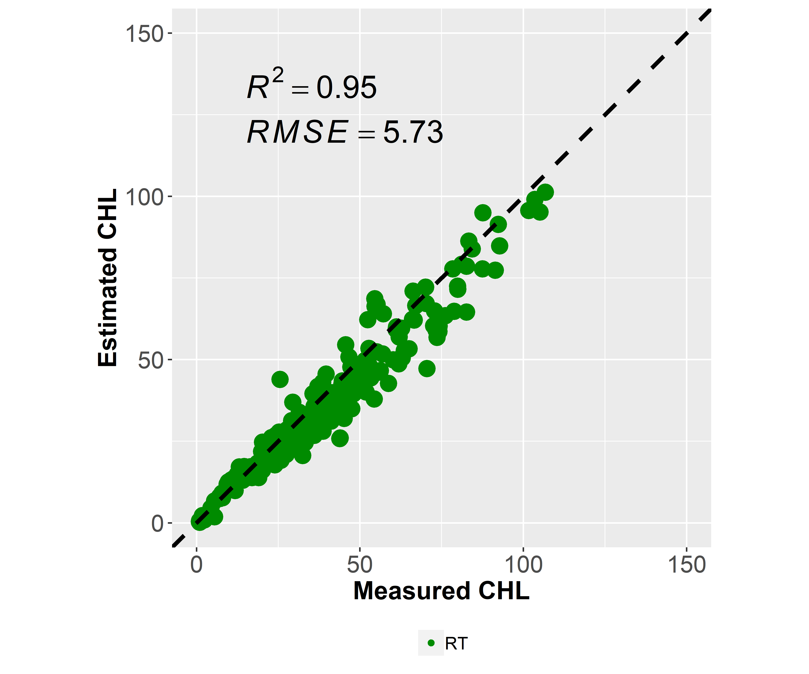
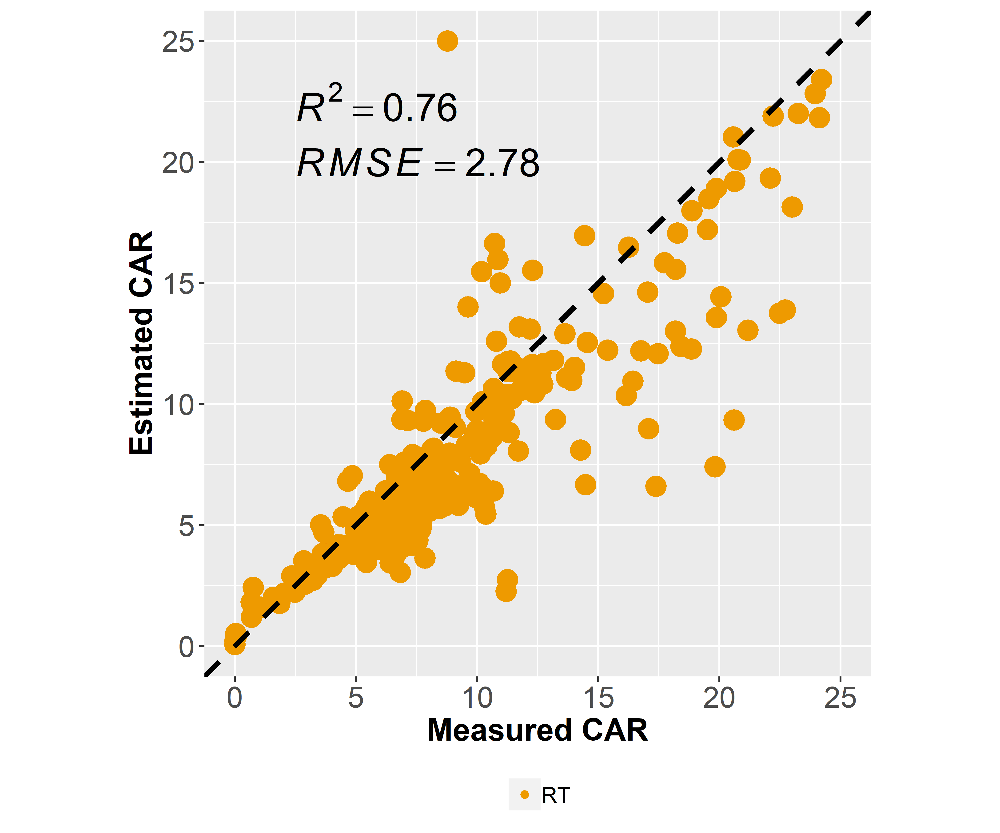
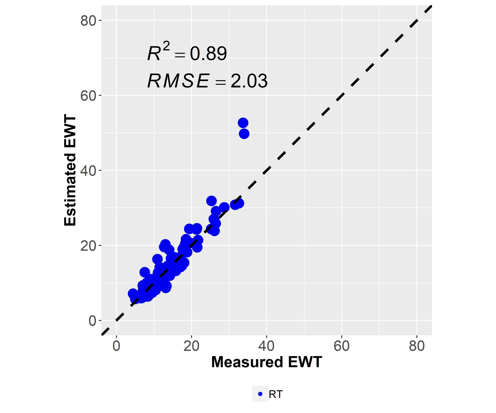
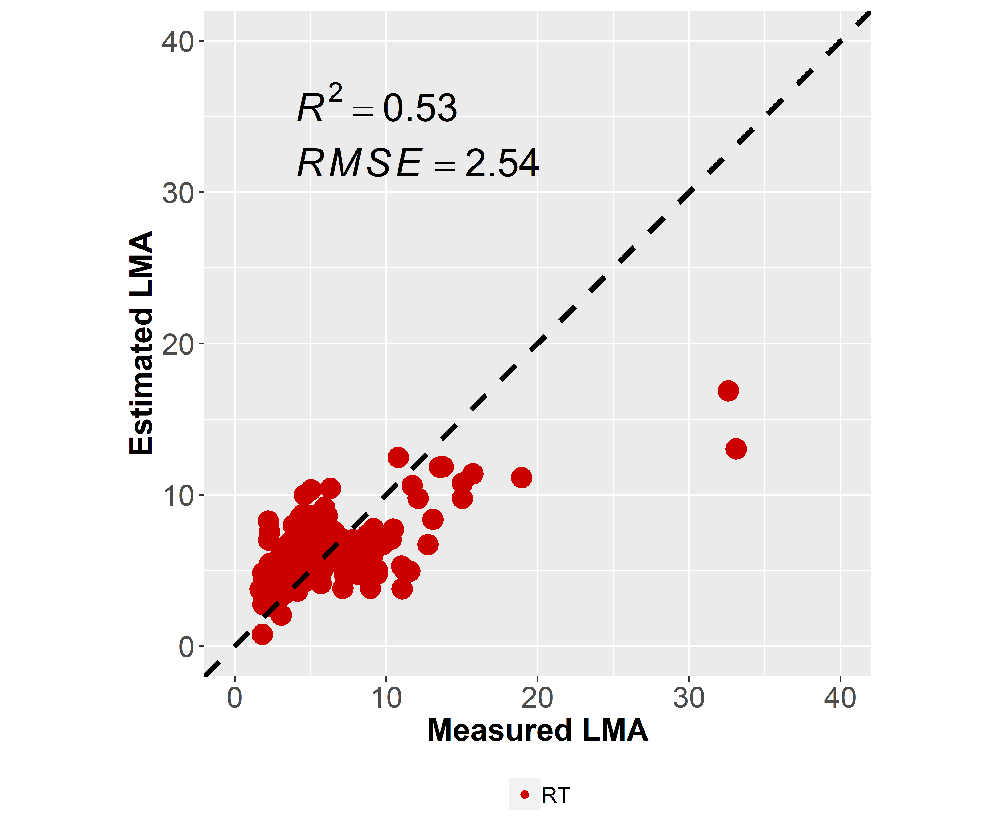
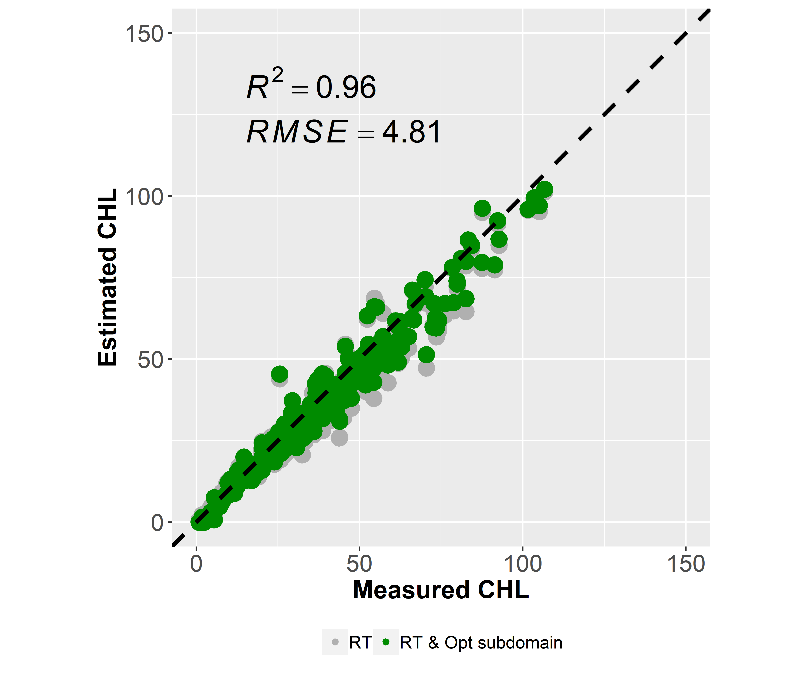
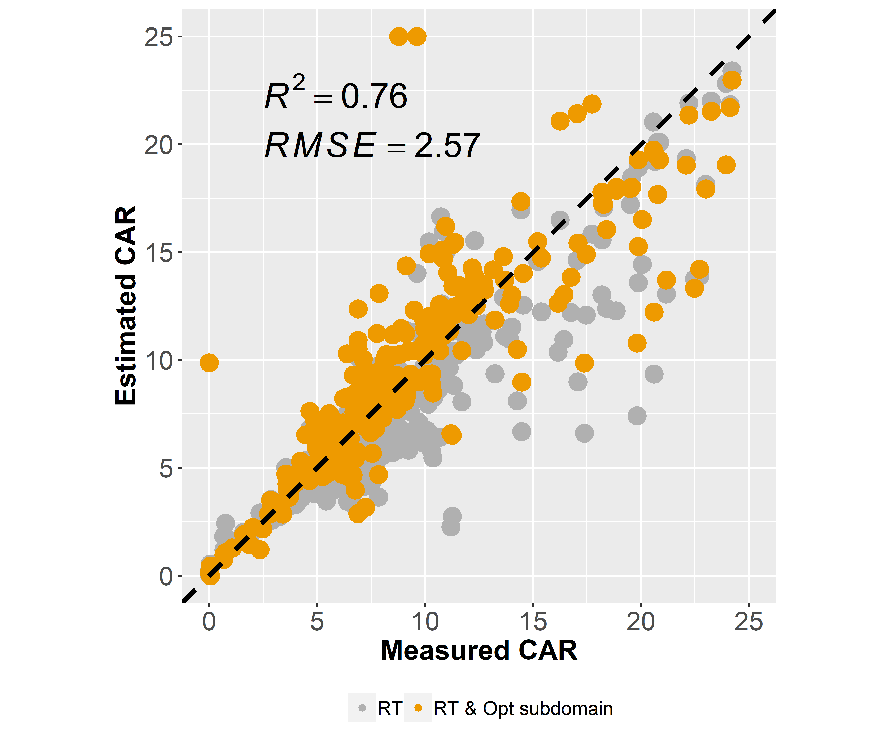
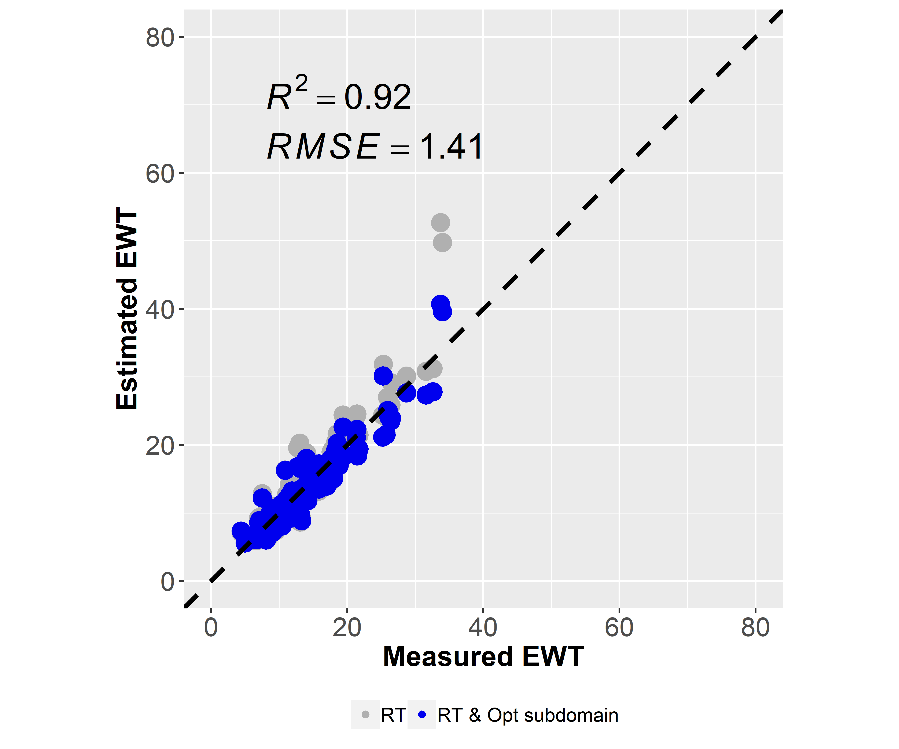
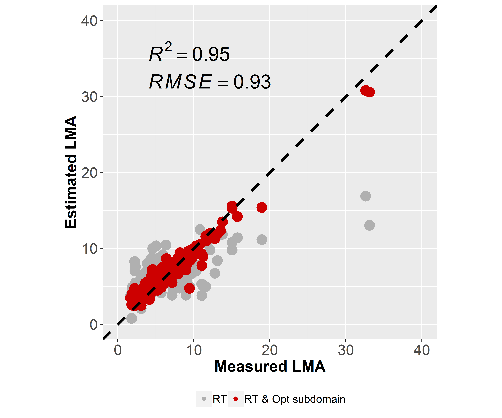

```{r setup, include = FALSE}
knitr::opts_chunk$set(
  collapse = TRUE,
  comment = "#>",
  eval=FALSE
)
```


This tutorial aims at describing a real study case using experimental leaf optics. 
The ANGERS leaf dataset is used here. 

# Download ANGERS datasets

The ANGERS dataset is available online and can be downloaded directly with an R 
script.
This dataset includes directional-hemispherical reflectance and transmittance. 
It also includes a set of measured chemical constituents: `chl`,`car`,`ewt`, 
and `lma`.

```{r get ANGERS}
# Libraries required 
library(prospect)
lop_database <- download_leaf_db(db_name = 'ANGERS')
```

# PROSPECT-D inversion: using full spectral information

PROSPECT-D can be inverted using the full spectral domain available from the data. 
This corresponds to the domain from 400 nm to 2450 nm.
Experimental leaf optics and optical constants of PROSPECT need to be adjusted 
before running `invert_prospect`. 
`chl`, `car`, `ant`, `ewt`, and `lma` are assessed when setting 
`parms_to_estimate  <- 'ALL'`

```{r Invert PROSPECT-D Full}
# assess all parameters for PROSPECT-D
parms_to_estimate  <- 'ALL'
# adjust PROSPECT optical constants & experimental leaf optics before inversion
subset_lop <- fit_spectral_data(lambda = lop_database$lambda,
                                refl = lop_database$refl, 
                                tran = lop_database$tran)
print('prospect inversion using full spectral range')
options <- set_options_prospect(fun = 'invert_prospect')
options$spec_prospect <- subset_lop$spec_prospect
res <- invert_prospect(refl = subset_lop$refl, 
                       tran = subset_lop$tran, 
                       prospect_version = 'D',
                       parms_to_estimate = parms_to_estimate, 
                       options = options)
```

## Results: estimation of `chl`, `car`, `ewt` and `lma`

Results obtained with the R package `prospect` and matlab implementation are consistent.

<p float="left">
  
  
</p>
<p float="left">
  
  
</p>
<center>
  Fig. 1. `chl`, `car`, `ewt` and `lma` assessed from ANGERS dataset using 
  PROSPECT-D inversion and full spectral information available.
</center> 
<p>&nbsp;</p>


# PROSPECT-D inversion: using optimal spectral domains

PROSPECT-D can be inverted using the optimal spectral domain defined for each 
of the constituents. 
`chl`, `car`, `ant`, `ewt`, and `lma` can be assessed. However, no optimal 
spectral domain has been investigated for ant so far, so the VNIR domain from 
400 nm to 800 nm is used in this case...

```{r Invert PROSPECT-D Opt}
# assess all parameters for PROSPECT-D 
parms_to_estimate  <- c('chl','car','ant','ewt','lma')
print('prospect inversion using optimal setting')
ParmEst <- invert_prospect_opt(lambda = lop_database$lambda, 
                               refl = lop_database$refl, 
                               tran = lop_database$tran, 
                               prospect_version = 'D',
                               parms_to_estimate = parms_to_estimate)
```

## Results: estimation of `chl`, `car`, `ewt` and `lma`

<p float="left">
  
  
</p>
<p float="left">
  
  
</p>
<center>
  Fig. 2. Estimation of `chl`, `car`, `ewt` and `lma` from ANGERS using 
  PROSPECT-D inversion and optimal subdomains for each of these constituents. 
</center> 
<p>&nbsp;</p>
