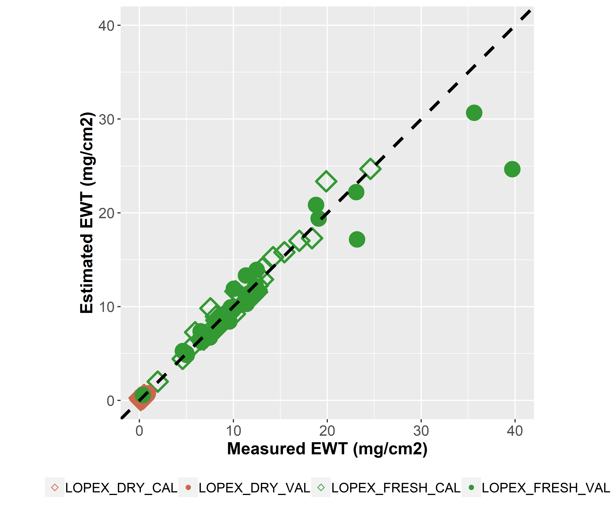
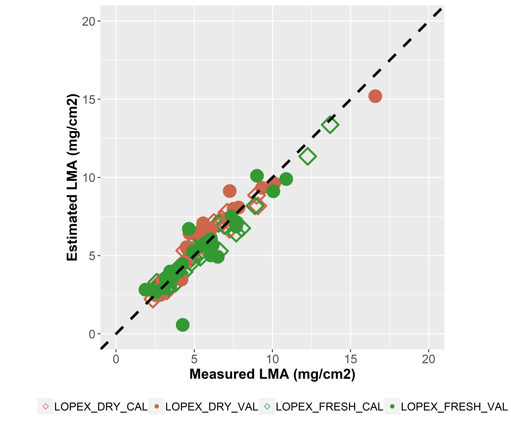
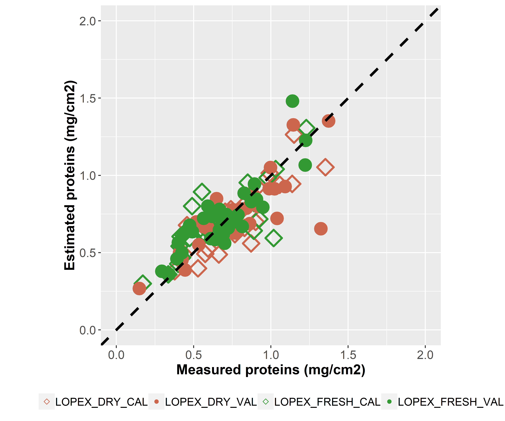
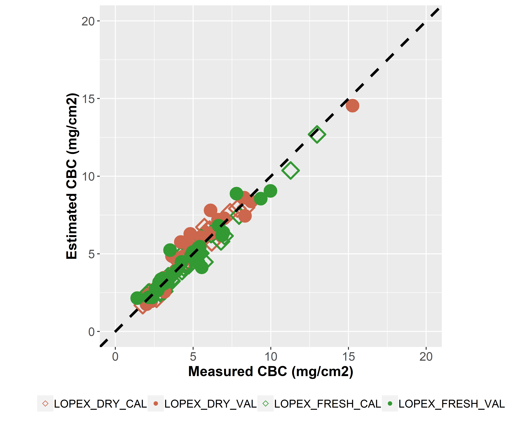
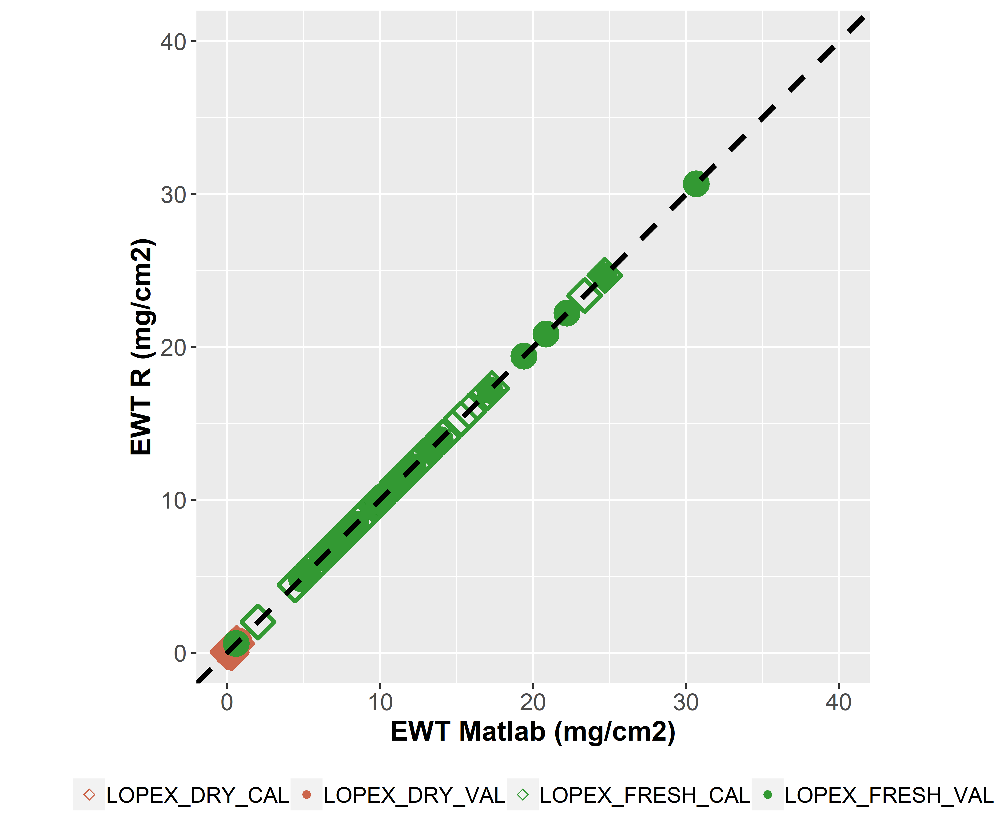
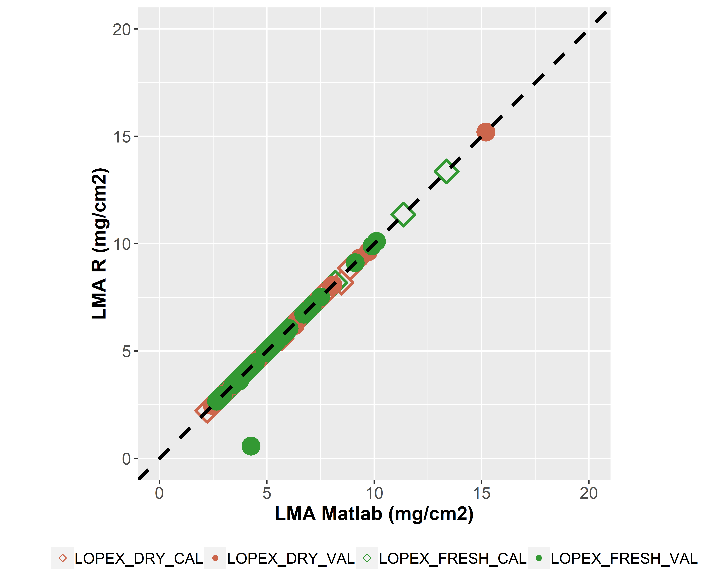
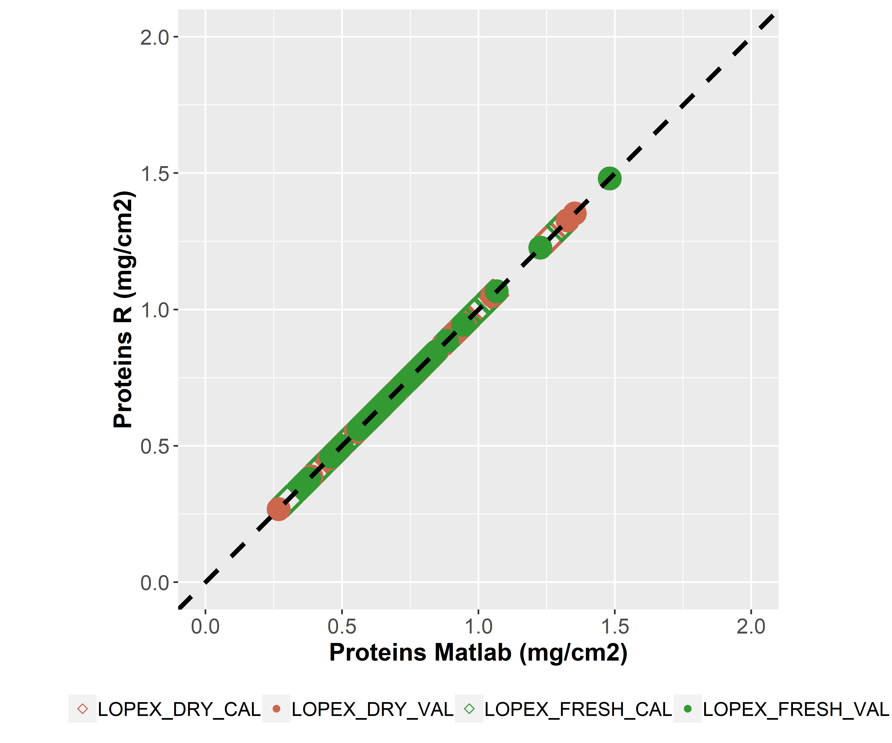
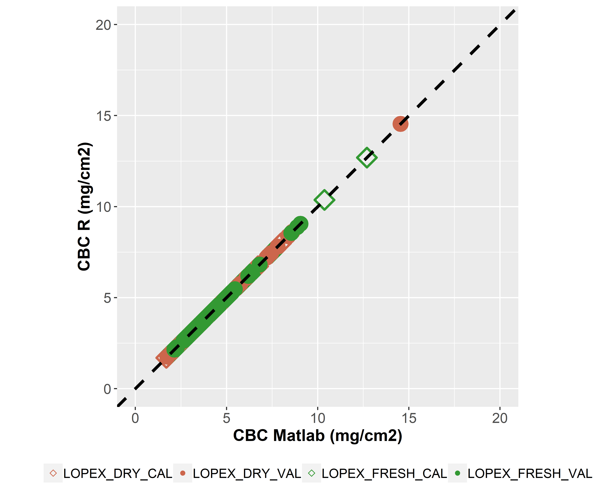

```{r setup, include = FALSE}
knitr::opts_chunk$set(
  collapse = TRUE,
  comment = "#>",
  eval=FALSE
)
```


# Download LOPEX datasets

The leaf optical properties used in [Féret et al. (2021)](https://doi.org/10.1016/j.rse.2020.112173) are available online. 
These datasets are produced from the LOPEX dataset, split into four specific subsets:

*  __LOPEX_DRY_CAL__ and __LOPEX_FRESH_CAL__ correspond to the dry and fresh samples extracted from the LOPEX dataset and used for the __calibration__ of __PROSPECT-PRO__

* __LOPEX_DRY_VAL__ and __LOPEX_FRESH_VAL__ correspond to the dry and fresh samples extracted from the LOPEX dataset and used for the __validation__ of __PROSPECT-PRO__

These datasets include directional-hemispherical reflectance and transmittance data. 
They also include a set of measured chemical constituents: `EWT`, `LMA`, `PROT` and `CBC`.

The datasets can be downloaded directly with an R script as described below. 


```{r get LOPEX}
# Libraries required 
library(prospect)
library(data.table)
# repository where data are stored
gitlab_Rep <- 'https://gitlab.com/jbferet/myshareddata/raw/master/LOP/'
# Datasets
dbName <- list('LOPEX_DRY_CAL','LOPEX_FRESH_CAL','LOPEX_DRY_VAL','LOPEX_FRESH_VAL')
# files available
fileName <- list('DataBioch.txt','ReflectanceData.txt','TransmittanceData.txt')
# download LOPEX data
DataBioch <- Refl <- Tran <- lambda <- list()
for (db in dbName){
  DataBioch[[db]] <- fread(file.path(gitlab_Rep,db,fileName[[1]]))
  Refl[[db]] <- fread(file.path(gitlab_Rep,db,fileName[[2]]))
  Tran[[db]] <- fread(file.path(gitlab_Rep,db,fileName[[3]]))
  lambda[[db]] <- Refl[[db]]$wavelength
  Refl[[db]]$wavelength <- Tran[[db]]$wavelength <- NULL
}

```

# Inversion of PROSPECT-PRO using optimal subdomains

The inversion of PROSPECT-PRO is performed using the optimal spectral domains corresponding to each constituent of interest. 
`EWT`, `PROT` and `CBC` are estimated here. 
The optimal spectral domains are defined based on the results described in [Féret et al. (2021)](https://doi.org/10.1016/j.rse.2020.112173). 

```{r Invert PROSPECT-PRO}
Parms2Estimate  <- c('EWT','PROT','CBC')
EWT_mod <- PROT_mod <- CBC_mod <- list()
# perform PROSPECT inversion using the optimal spectral domains for EWT, PROT and CBC
InitValues <- data.frame(CHL = 40, CAR = 8, ANT = 0.1, BROWN = 0, 
                         EWT = 0.01, CBC = 0.009, PROT = 0.001, N = 1.5)
for (db in dbName){
  print('PROSPECT inversion using optimal spectral domains')
  ParmEst <- Invert_PROSPECT_OPT(lambda = lambda[[db]], 
                                 Refl = Refl[[db]], 
                                 Tran = Tran[[db]], 
                                 PROSPECT_version = 'PRO',
                                 Parms2Estimate = Parms2Estimate, 
                                 InitValues = InitValues)
  EWT_mod[[db]] <- ParmEst$EWT
  PROT_mod[[db]] <- ParmEst$PROT
  CBC_mod[[db]] <- ParmEst$CBC
}
```

# Results: estimation of `PROT`, `CBC`, `EWT` and `LMA`

The results obtained with the R package `prospect` are very close to those obtained with matlab, using the same algorithm for iterative optimization (with the function `fmincon`).

<p float="left">
  
  
</p>
<p float="left">
  
  
</p>
<center>
  Fig. 1. Estimation of `PROT`, `CBC`, `EWT` and `LMA` as `PROT`+`CBC` using PROSPECT-PRO inversion
</center> 
<p>&nbsp;</p>


For the sake of comparison, the comparison of the results obtained with __Matlab__ and __R__ are presented in Fig. 2.
__The performances are identical__. 
The parametrization of the inversion may not be appropriate and fail to converge. 
In this case, the inversion returns `NA`s and the `Tolerance` parameter of the iterative optimization is adjusted to a higher value in order to converge. 
`Tolerance` is increased automatically as long as the convergence is not reached, to a certain extent. 
If convergence is not obtained for `Tolerance = 1e-2`, then the inversion returns `NA`s.

<p float="left">
  
  
</p>
<p float="left">
  
  
</p>
<center>
  Fig. 2. Comparison of th performances obtained with Matlab and R for the estimatinon of `PROT`, `CBC`, `EWT` and `LMA` as `PROT`+`CBC` using PROSPECT-PRO inversion
</center> 
<p>&nbsp;</p>
